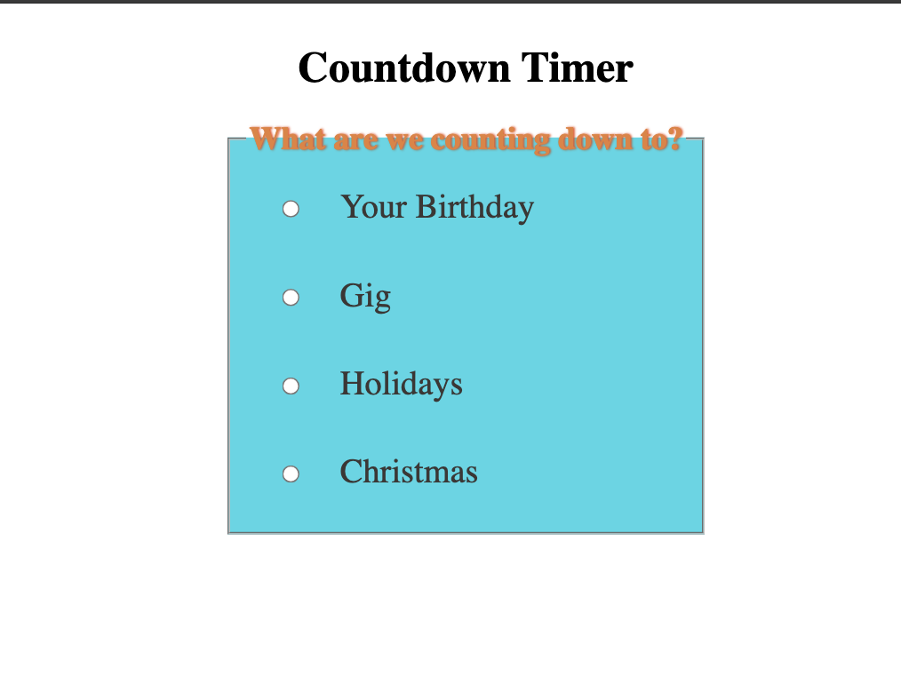
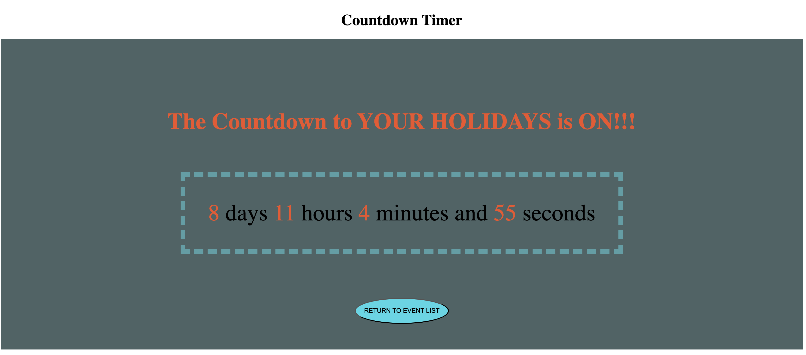
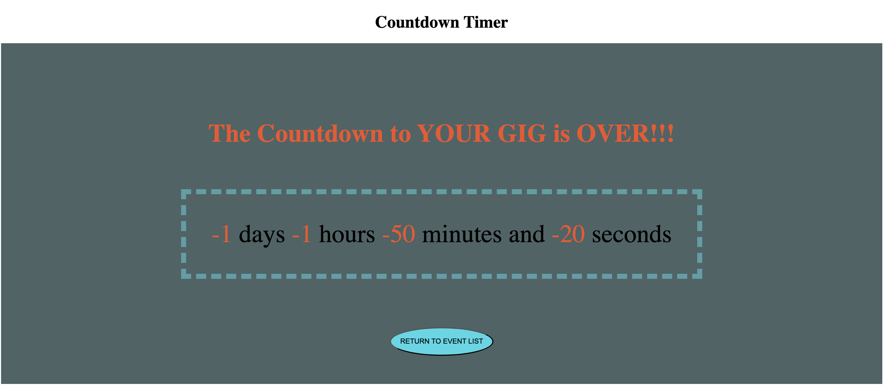

<!-- Title -->

# Countdown TImer

## Description

This is a simple countdown timer created using CSS,HTML and Javascript.

I built this project in order to practice and solidify Javascript concepts.

## How to Use the Project

The timer is very simple to use. On the landing page you select one of the 4 upcoming pre-programmed events to get the countdown.

Once selected the event list is replaced with a countdown timer that dynamically updates every second, displaying the number of days, hours, minutes and seconds left until the event.

When the event date and time is reached message over the timer changes to state that your countdown is over.

You can return to the list of events using the "return to event list" button underneath the countdown timer

## Future Improvements

Future improvements to the countdown include:

- adding pause/reset buttons to allow greater control over the timer,
- add an animation when the event time is reached,
- allow for dynamic user input to specify events and there date/time
